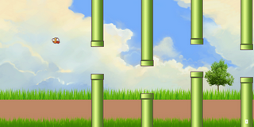

## 像素鸟
使用pygame制作完成的像素鸟游戏
- flappyBird_origin.py  

- flappyBird.py  

### hog + svm 小鸟辨识
在原版游戏基础上进行，训练数据使用``birdDataGen.py``自动生成。  
正样本：目前只生成红色小鸟的数据，且小鸟没有进行旋转。  
负样本：可以修改背景图片，获取更多负样本。 

数据处理和训练过程查看``svm_bird.ipynb``，使用的是``svm``的线性分类器。

Todos：
- 实时辨识小鸟